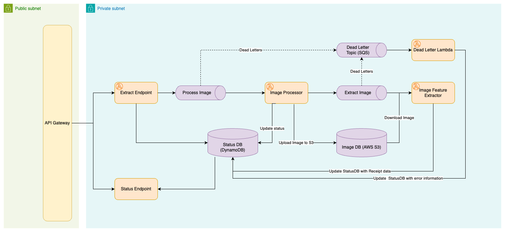

# Receipt Extractor

This repository represents a Receipt Data Extractor. An AI powered API that processes receipt image data and will
extract information regarding the receipt items and total.

## Model and Input

This application leverages a transformer that follows the [Donut](https://arxiv.org/abs/2111.15664) architecture in
order to transform images into
structurd text. More specifically, it leverages
the [naver-clova-ix/donut-base-finetuned-cord-v2](https://huggingface.co/naver-clova-ix/donut-base-finetuned-cord-v2)
model which has been fine-tuned to transform images of receipts into structured JSON documents. One of the reasons we
chose this model was to supplement the typical "Bounding Box" techniques present in modern image processing solutions
such as [AWS Textract](https://aws.amazon.com/textract/). With developments like Donut, image processing systems can
begin to leverage the transformer model architecture to process images into structured text instead of traditional
computer vision models.

## Getting Started

In order to get started working with this repository you must first install the following development tools, and then
follow the [instructions](#getting-started---instructions) section of this document

***Tools***

- Python - Have a python environment activated using python 3.9
- [Poetry](https://python-poetry.org/) - Used for managing python packages and environments
- [Docker](https://www.docker.com/) - Used to build the container images in the application
- [Terraform](https://www.terraform.io/) - Used to manage Infrastructure as Code (IAC)s
- [AWS CLI](https://aws.amazon.com/cli/) - Used to communicate with your AWS environment, be sure to authenticate your
  AWS CLI with the proper AWS environment

### Getting Started - Instructions

To get the project installed in a poetry environment, run the following command

#### Python Setup

To install all dependencies for this project, simply run the following

```shell
poetry install
```

This will load all python packages into your virtual environment

#### Infrastructure Setup - Deployment

In order to deploy the `Receipt Extractor` application, you will need to deploy the terraform application to your AWS
environment. All of the infrastructure for this proejct is specified in the [infrastructure](infrastructure/) folder. By
default this project is configured to deploy in the `us-east-2` region and set up 3 private/public subnets in a VPC. In
order to change these settings, please see the [terraform.tfvars](infrastructure/terraform.tfvars) file.

In order to deploy the terraform infrastructure, run the following commands

***Terraform Plan***

First create a terraform plan by running the following inside the `infrastructure/` folder

```shell
terraform plan -out plan.tf
```

This will generate output to notify you of all the changes to be made to your AWS environment. When you are ready to
apply your changes to your AWS environment, run the following command

```shell
terraform apply tf.plan 
```

This will create all required infrastructure outlined in the [System Design](#system-design) along with building the
required docker image(s) for the system.

***Note***: This application was built using an ARM based machine (Apple M3 based laptop). Because of this the AWS
Lambda functions, docker images, and python package installation is optimized to run on ARM based systems that leverage
the [AWS Graviton](https://aws.amazon.com/ec2/graviton/) processors. If you attempt to deploy this project using an x86
machine, some changes may need to be made to the [Dockerfile](Dockerfile), Lambda Functions, and python packages that
the project depends on.

***Sample Notebook***: After your application is deployed, you can use
this [Sample Notebook](notebooks/api_example.ipynb) to invoke the API for testing.

## Software Architecture

This project leverages a [Hexagonal Architecture](https://en.wikipedia.org/wiki/Hexagonal_architecture_(software)) in
Python. This means that common dataclasses and interfaces are defined in the [core](receipt_extractor/core/) python
package, while specific implementations are leveraged in other python packages.

For example, the [Receipt Repository](receipt_extractor/core/receipt.py#L112) interface is defined in the core package,
while the implementation that uses AWS DynamoDB for the ReceiptRepository is defined in
the [dynamodb](receipt_extractor/dynamodb) package.

Additionally, the AWS Lambda entrypoints are all implemented in the root of the `receipt_extractor/` directory. These
files import all required libraries and packages to process individual lambda functions.

## System Design

Below is a high level diagram of the system design of the receipt extractor. We will dive into the individual components
outlining the implementation in this section


### Database - DynamoDB

The main database used to store receipt data for this application is DynamoDB. DynamoDB is currently provisioned in "
ON_DEMAND" mode. If increased price performance and throughput is required, you should alter
the [terraform](infrastructure/dynamo_receipt_table.tf) for this table. Data stored in the dynamo table uses
a [Time To Live (TTL)](https://docs.aws.amazon.com/amazondynamodb/latest/developerguide/TTL.html) timestamp to ensure
that the database is not continuously growing in size.

### File Storage - S3

In order to store receipt files for processing we leverage an [AWS S3](infrastructure/s3_bucket_receipt_data.tf) bucket.
Files stored in this bucket are expired after 24 hours to ensure that the bucket does not continuously grow in size.

### API Gateway

The API Gateway is the public facing API to the receipt extractor. This API has one endpoint defined with two HTTP
methods. Below is an example of how to invoke the API

***Create Receipt Extraction Request***

```shell
curl --location 'https://${HOST}/PROD/receipt' \
--header 'Content-Type: application/json' \
--data '{
    "application_id": "${UUID}", 
    "image_url": "${IMAGE_URL}"
}'
Response: 
{"application_id":"${UUID}","request_id":"${UUID}","image_url":"${IMAGE_URL}","status":"RECEIVED","file_path":null,"image_type":"jpg","data":null}
```

***Check Status of Image Request***

```shell
curl --location 'https://${HOST}/PROD/receipt?id=${RECEIPT_ID}'
Response: 
{"application_id":"${UUID}","request_id":"${UUID}","image_url":"${IMAGE_URL}","status":"PROCESSED","file_path":null,"image_type":"jpg","data":null}
```

### Process Image Kinesis Stream

The ["Process Image" Kinesis Stream](infrastructure/kinesis_streams.tf) is responsible for facilitating the intake of
new image metadata. Currently the stream is configured for "ON_DEMAND" capacity, however, to configure the stream for
higher throughput we can move it to a "PROVISIONED" capacity which will increase the amount of parallelism present in
the Kinesis Consumers

### Process Receipt Lambda

The ["Process Receipt" Lambda Function](infrastructure/lambda_process_receipt.tf) is responsible for consuming
events/records from the "Process Image" Kinesis Stream and persisting Receipt Images
in [AWS S3](infrastructure/s3_bucket_receipt_data.tf). This Lambda function acts as
an [Anti Corruption Layer](https://learn.microsoft.com/en-us/azure/architecture/patterns/anti-corruption-layer) to
ensure that images can be downloaded in the proper format before data processing.

### Extract Data Kinesis Stream

The ["Extract Data" Kinesis Stream](infrastructure/kinesis_streams.tf) is responsible for facilitating the intake of
new receipt images that are ready for data processing. Similarly to the "Process Image" stream, the "Extract Data"
Stream is configured for "ON_DEMAND" capacity, however, to configure the stream for
higher throughput we can move it to a "PROVISIONED" capacity which will increase the amount of parallelism present in
the Kinesis Consumers

### Extract Data Lambda

The ["Extract Data" Lambda Function](infrastructure/lambda_extract_data.tf) is responsible for consuming
events/records from the "Extract Data Image" Kinesis Stream, downloading the Receipt Images from AWS S3 and using
the [donut-base-finetuned-cord-v2](https://huggingface.co/naver-clova-ix/donut-base-finetuned-cord-v2) model to extract
receipt information from the receipt image. The entire process to invoke
the [donut-base-finetuned-cord-v2](https://huggingface.co/naver-clova-ix/donut-base-finetuned-cord-v2) model can take up
to 90 seconds in the worst case. So, to ensure the system can scale to its maximum potential its important to note that
the fine-tuning of the ["Extract Data" Kinesis Stream's](infrastructure/kinesis_streams.tf) provisioned throuput would
be key to enabling this system to scale to meet demant.

**Note:** If the existing latency of ~30-90 seconds to produce receipt data is not sufficent for the use case of
extracting receipt data, we would explore options of configuring this system to leverage AWS technologies such
as [SageMaker: Real Time Inference](https://docs.aws.amazon.com/sagemaker/latest/dg/realtime-endpoints.html)
or [GPUs on ECS](https://docs.aws.amazon.com/AmazonECS/latest/developerguide/ecs-gpu.html) to accelerate this process
using specialized hardware (e.g. Nvidia GPUs or XLA devices such
as [AWS Inferentia](https://aws.amazon.com/machine-learning/inferentia/))

### Dead Letter SNS Topic

If a failure were to occur when processing data from any of
the [AWS Kinesis Streams](infrastructure/kinesis_streams.tf), the AWS Lambda Dead Letter integration will deliver a
message to the [Dead Letter SNS Topic](infrastructure/sqs_dead_letters.tf) configured for this project.

#### Dead Letter Lambda

When messages are delivered to the [Dead Letter SNS Topic](infrastructure/sqs_dead_letters.tf)
the [Dead Letter Lambda Function](infrastructure/lambda_dead_letters.tf) will update the status of the receipt record in
DynamoDB to reflect an errored state. This enables consumers of this system to add application specific logic around
failed interactions with the receipt data processing system. 