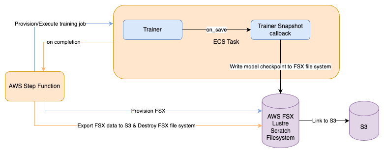

# Question 2

Resuming Training
Question about Trainer. We have someone using Hugging Face Trainer to finetune our cluster. If there is an error during
the training job, any data not explicitly synced to external storage is lost. This includes any model checkpoints.
Design a recommended way for syncing checkpoints to external storage (e.g., s3) instead of just writing them locally
during training.

## Solution

In order to maintain model state during training, I would proposed that we
leverage [AWS Step Functions](https://aws.amazon.com/step-functions/) to orchestrate the training workflow via AWS ECS (
using [GPUs on AWS ECS](https://docs.aws.amazon.com/AmazonECS/latest/developerguide/ecs-gpu.html) if necessary). The
high level workflow of the training job would follow the below steps.

- AWS Step Function provisions [FSX Lustre Scratch File System](https://aws.amazon.com/fsx/lustre/) linked with a data
  repository to S3.
- AWS Step Function provisions training job on AWS ECS Cluster
    - Training Job mounts to the FSX file system
    - Training Job configures a `TrainerCallback` to write model checkpoints to mounted fsx directory `on_save`
        - Refer
          to [TrainerCallBack](https://huggingface.co/docs/transformers/v4.38.1/en/main_classes/callback#transformers.TrainerCallback)
          documentation
- Training job completes (in either a success or error state)
- AWS Step Function executes a FSX task to export model artifacts to S3 Repository
- AWS Step Function destroys FSX File system after the export task is complete.

### High Level Architecture

The high level architecture of this solution mentioned is outlined in the diagram below

### Notes for Scaling

With this solution, the main concern for scaling the data transfer of model weights is on the FSX Lustre Scratch File
System. In order to get this file system to perform optimally there are a few things to keep in mind.

1. Scratch vs Persistent file systems: [FSX Lustre File Systems](https://aws.amazon.com/fsx/lustre/) support
   both `Scratch` and `Persistent` file systems. Typically, the tradeoff between scratch and persistent file systems is
   high availability (i.e. multiple AZs/Nodes) vs high throughput. So scratch filesystems will have higher throughput
   guarantees while Persistent file systems will have higher availability guarantees. So its important to take your
   training workflow into account when deciding to use a scratch vs persistent file system.
2. File Striping: On distributed file systems, configuring the
   proper [File Striping](https://docs.aws.amazon.com/fsx/latest/LustreGuide/performance.html#striping-data) settings
   are key to understanding the overall throughput of loading large files on a distributed file system. So file striping
   settings will need to be optimized in this training job to accommodate the number of files, and file sizes present in
   the model checkpoints 